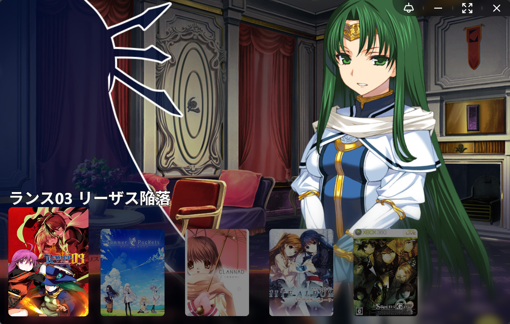
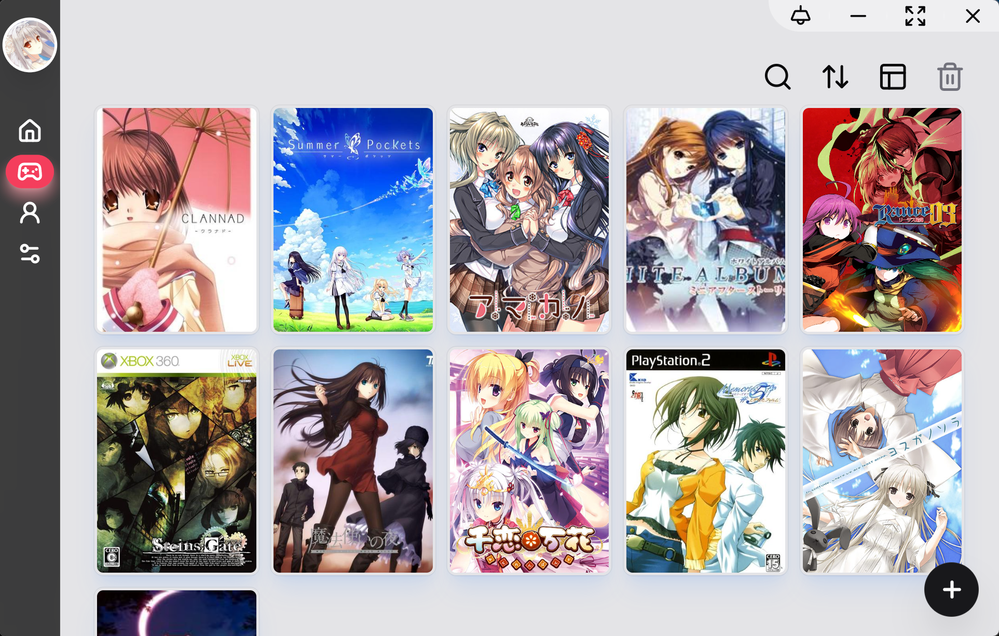
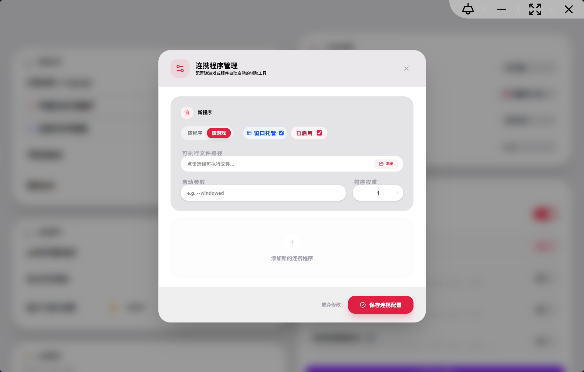

<div align="center">
YumiHub

A local ACG game management tool.

[简体中文](./README.md) | English

</div>

---

## 📍 Table of Contents

* [📖 Introduction](#-introduction)
* [🌟 Key Features](#-key-features)
* [🛠️ Tech Stack](#-tech-stack)
* [📸 Showcases](#-showcases)
* [📥 Installation](#-installation)
* [🎨 Themes](#-themes)
* [🚀 Quick Start (Development)](#-quick-start-development)
* [⚖️ Disclaimer](#-disclaimer)
* [📄 License](#-license)

## 📖 Introduction

YumiHub is a local game (Galgame) library management tool built with Tauri. It is designed to help users consolidate game resources, scrape metadata, and manage companion applications for a seamless gaming experience.

## 🌟 Key Features

    Resource Import: Support for direct importing of ZIP and RAR archives.

    Companion Linkage: Automatically launch external programs (e.g., translators, controller mappers) alongside your game.

    Data Binding: Integrated Bangumi and VNDB APIs for automatic fetching of covers, ratings, and game details.

    Modern UI/UX: A fully responsive interface powered by React 19 and Tailwind CSS.

## 🛠️ Tech Stack

    Frontend: React 19

    Desktop Framework: Tauri 2.0 (Rust)

    Styling: Tailwind CSS / Shadcn UI

    State Management: Zustand

    Database: SQLite (SQLx)

    Runtime: Bun

## 📸 Screenshots

<p align="center"> <em>Home Dashboard</em>



<em>Library View</em>



<em>Companion App Management</em>

 </p>

## 📥 Installation

Download the latest installer for your platform from the Releases Page.
[Releases](https://github.com/yumilengjiao/yumihub/releases)

## 🎨 Themes

You can download theme files from the themes directory. Each file represents a unique theme. To apply a theme:

    Download a theme file (e.g., neon-glass.json5).

    Locate the program's theme directory at:

    C:\Users\yourusername\AppData\Local\io.github.yumilengjiao.yumihub\themes

    Place the downloaded .json5 file into this folder.

        Note: You will see a default.json5 file in this directory. Do not delete it, as it is essential for the program to run correctly.

    Restart the application.

    Apply: Go to the settings page under Appearance -> Theme Selection to switch your theme.

You can preview the [appearance](./themes/theme_sample) of each theme in the Theme Gallery.

## 🚀 Quick Start (Development)

1. **Clone Repository**:

    ```shell
    git clone https://github.com/yumilengjiao/yumihub.git
    cd yumihub

1. **Requirements**: Ensure Bun and Rust are installed.
1. **Install Dependencies**:

    ```shell
    bun install
    ```

1. **Dev**:

    ```
    bun tauri dev
    ```

1. **Build**:

    ```
    bun tauri build
    ```

## ⚖️ Disclaimer

Resources are sourced from the internet; copyrights belong to the original owners. For educational purposes only. Non-commercial use.

## 📄 License

This project is licensed under the [MIT License](./LICENSE).
