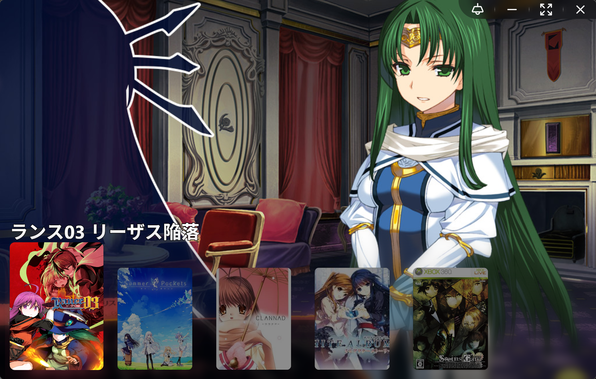
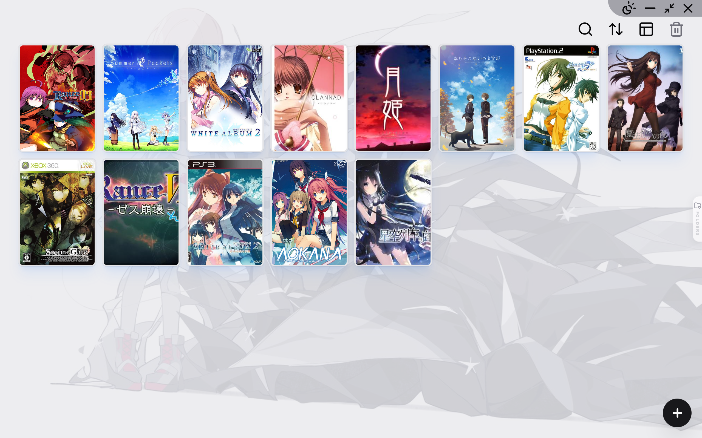
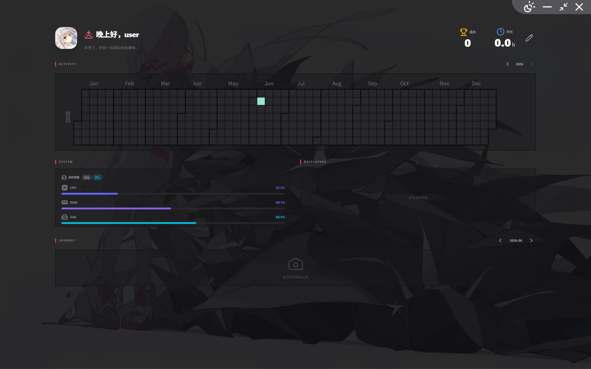
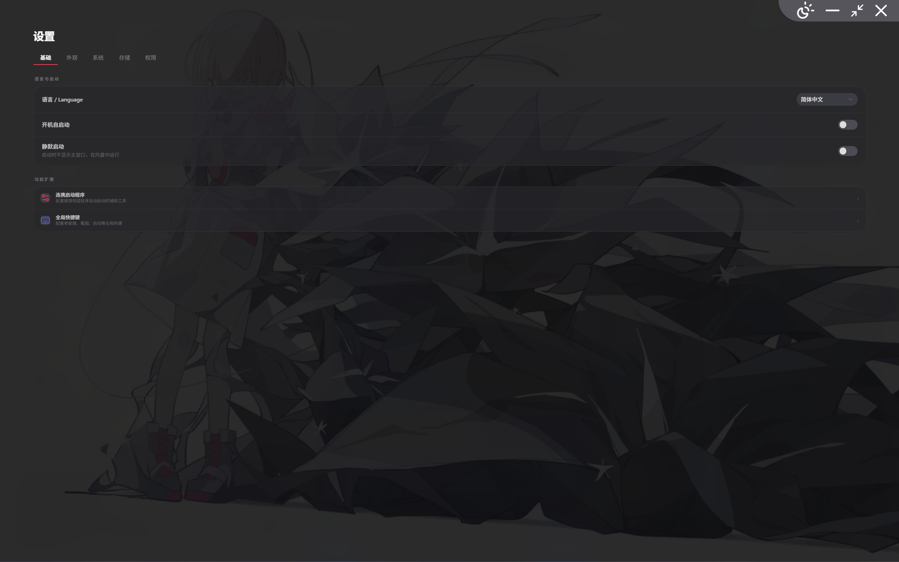
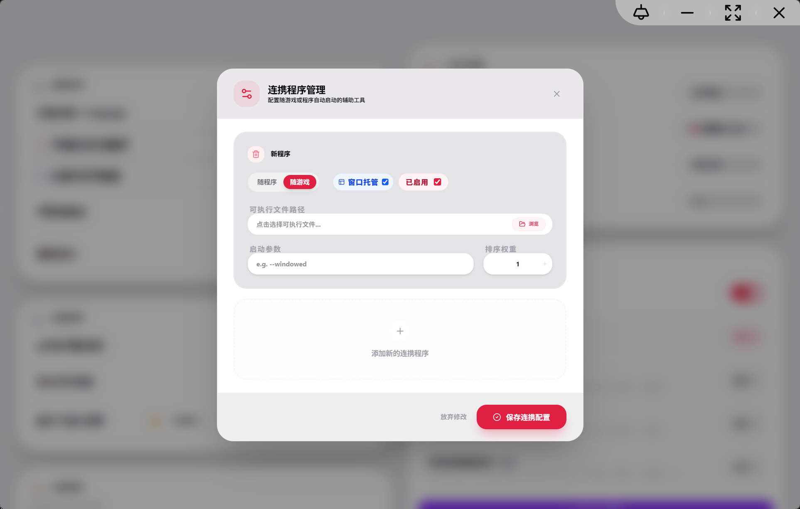

<div align="center">

# YumiHub

A local ACG game management tool

[Simplified Chinese](./README.md) | English

</div>

---

## 📍 Table of Contents

* [📖 Introduction](#-introduction)
* [🌟 Key Features](#-key-features)
* [🛠️ Tech Stack](#-tech-stack)
* [📸 Screenshots](#-screenshots)
* [📥 Installation](#-installation)
* [🎨 Themes](#-themes)
* [🚀 Quick Start (Development)](#-quick-start-development)
* [💪 Support](#-support)
* [⚖️ Disclaimer](#-disclaimer)
* [📄 License](#-license)

## 📖 Introduction

YumiHub is a local game (Galgame) library management tool built with Tauri. It is designed to integrate game resources, metadata fetching, and external program launching.

## 🌟 Key Features

* **Resource Import**: Supports direct import from `ZIP` / `RAR` archives.
* **Companion Program Integration**: Supports launching manually added companion programs when starting a game, such as translators, controller mapping tools, and more.
* **Data Binding**: Integrates the Bangumi and VNDB APIs to automatically fetch covers and details.
* **Interface Interaction**: Responsive design based on React 19 and Tailwind CSS.

## 🛠️ Tech Stack

* **Frontend Framework**: React 19
* **Desktop Framework**: Tauri 2.0 (Rust)
* **Styling Libraries**: Tailwind CSS / Shadcn UI
* **State Management**: Zustand
* **Database**: SQLite (SQLx)
* **Runtime**: Bun

## 📸 Screenshots

<p align="center">
  <em>Home</em><br>
  
  <br><br>
  <em>Game Library</em><br>
  
  <br><br>
  <em>User Interface</em><br>
  
  <br><br>
  <em>Settings</em><br>
  
  <br><br>
  <em>Companion Program Management</em><br>
  
</p>

## 📥 Installation

You can download the installer for your platform from the [Releases page](https://github.com/yumilengjiao/yumihub/releases).

## 🎨 Themes

You can download theme files from the [themes](./themes) directory. Each file is a separate theme. Place the downloaded theme file, such as `neon-glass.json5`, into the program's themes directory:

**C:\Users\yourusername\AppData\Local\io.github.yumilengjiao.yumihub\themes**

By default, you will see a `default.json5` file in this directory. Do not delete it, otherwise the program may encounter errors. After placing the downloaded theme file in this directory, restart the program. You can then change the theme on the settings page under `Appearance -> Theme Selection`. The change takes effect after restarting.

You can view the style of each theme in [Theme Style Preview](./themes/theme_sample).

You can read [PROTOCOL](./docs/PROTOCOL.md) to learn how to write your own custom theme.

## 🚀 Quick Start (Development)

1. **Clone the repository**:

   ```shell
   git clone https://github.com/yumilengjiao/yumihub.git
   cd yumihub
   ```

2. **Install the environment**: Make sure Bun and Rust are installed.

3. **Install dependencies**:

   ```shell
   bun install
   ```

4. **Start development**:

   ```shell
   bun tauri dev
   ```

5. **Build package**:

   ```shell
   bun tauri build --no-sign
   ```

## 💪 Support

If you find this project helpful, you can scan the QR code to support me.

<p align="left">
  
</p>

## ⚖️ Disclaimer

The resources in this project come from the internet. If there is any infringement, please contact me.

## 📄 License

This project is open source under the [MIT License](./LICENSE).
